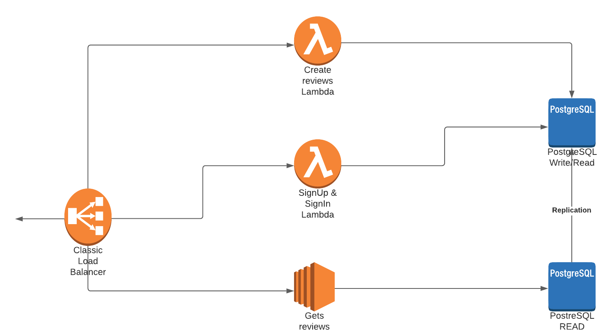

# RandomReviewCamera

### version Spanish

- [Spanish ](./docs/es/README.md)

## Overview

[definition of the project and customer requirements](./docs/en/definitionProject.md)

## Architecture

### PostgreSQL x2

- Replication
- A for W/R and other just for Reads
- I use PostgreSQL, why? i need simple relations for use replications

### Test Plan

- Register user, create reviews, that someone can log in and read reviews.
- I don't use TDD or BDD for my little experience with the tests.

### Load Balancer

I use Nginx, for its easy configuration.

### Node with Express

I use Express for management requests.

### Go with Gorilla/mux

I use for ease creation and management from requests.
