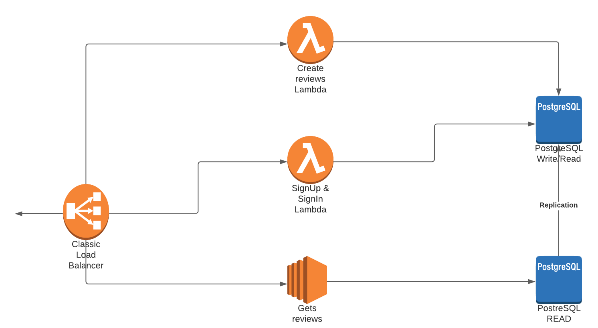

# RandomCameraReview es

## Overview

[Definicion del proyecto y requerimientos del cliente](/project_definition.md)

### Alcance(Scope)

#### Casos de Uso

description

1. caso 1

#### Casos de uso no soportados

description

1. caso 1

### Arquitectura

En ambos el desarrollo esta basado en los servicios de AWS, usando docker para emular el servicio lambda y luego ser agregado a ECR para la integracion directa con AWS Lambda.
Use Go y Node por que son los dos ultimos langs que aprendi este a~o.
Para las functions lambdas use el Driver de cada lang(go, node) para hacer inserts y querys simples.
En el caso de los EC2(tanto para go y node) use ORMs.

#### Load Balancer

Nginx como load Balancer, lo use por que es facil de configurar.

#### Node con Express

Para abstraer el manejo de middlewares y administracion de los verbs HTTP.

### Plan de Pruebas

1. Registrar usuario, crear reviews, que alguien pueda logearse y leerlo.
2. No use TDD o BDD por mi poca experiencia con los tests.
3. Go con Gorilla/mux
   Uso de gorilla/mux por que el manejo de HandleFuncs es facil y modulable. Para uso simple de los verbs GET, POST y PUT.
4. PostgreSQL x2

   - Replicacion
   - Una para escritura y lectura, la otra solo para lectura

   - Use PostqueSQL por que la replicacion por docker es sencilla.

   - Limitaciones
